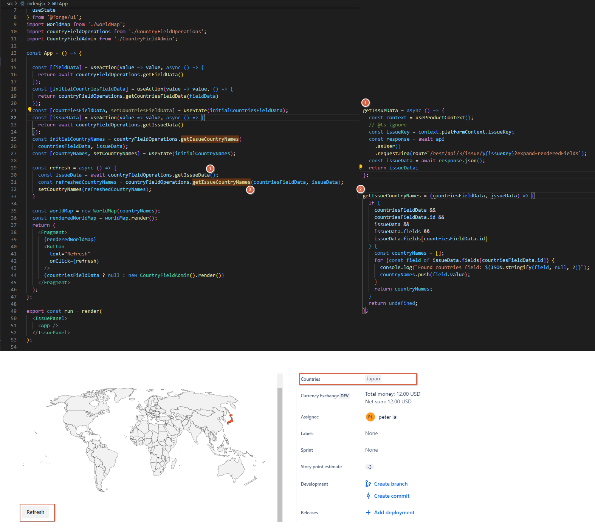

功能：
更改國家後按reflesh會更新map的著色位置

安裝方法:
使用vs code或其定ide, 開啟cmd出來，輸入`forge login`登入atlassian帳號
1. 下載代碼
2. 在cmd執行 `forge register`, 目的是更新manifest.xml的app id為你帳號所屬的
3. 在cmd執行 `npm install` , 自動下載必要的plugin
4. 在cmd執行 `forge deploy`, 編譯代碼及上載
5. 在cmd執行 `forge install`, 安裝app

1. 由於需要拿取到相關的issue裡的所有field，所以需要透過jira原生api拿到資料
2. 從api得到的資料中，搜尋所需要的field名稱(Countries)後把當中的id返回主程式作更新動作

# Forge Issue Countries

This is an example [Forge](https://developer.atlassian.com/platform/forge/) app that displays an issue panel comprising a world map highlighting the countries identified by a custom field.

## Requirements

See [Set up Forge](https://developer.atlassian.com/platform/forge/set-up-forge/) for instructions to get set up.

## Quick start
Once you have logged into the CLI (`forge login`), follow the steps below to install the app onto your site:
1. Clone this repository
2. Run `forge register` to register a new copy of this app to your developer account
3. Run `npm install` to install your dependencies
4. Run `forge deploy` to deploy the app into the default environment
5. Run `forge install` and follow the prompts to install the app

## Usage

When viewing an issues, a map will appear below the description of the issue. Use the countries custom field to select the countries that the issue applied to. After changing the countries, click the "Refresh" button below the map to hgihlight the selected countries.

## Installation

1. Navigate to a Jira issue page. You should see the a panel below the description titled "Countries" which contains a world map. This panel is produced by the app.
2. At the bottom of the panel, you should see a button labelled "Create country field". Click the button to create the custome field required by the app.
3. Reload the issue view and you should see the "Create country field" button is no longer visible.
4. To the right of the issue view, check if you see a field labelled "Countries". If you don't, visit the [custom fields admin](https://your-tenant.atlassian.net/secure/admin/ViewCustomFields.jspa), click the "..." button beside the "Countries" field, select "Associate to screens" and then select the screens corresponding to your issue view being shown.
5. Reload the issue view and check the "Countries" field is visible.
6. Select one of more countries from the "Countries" field.
7. Click the "Refresh" button below the countries map and check the selected countries are highlighted.
